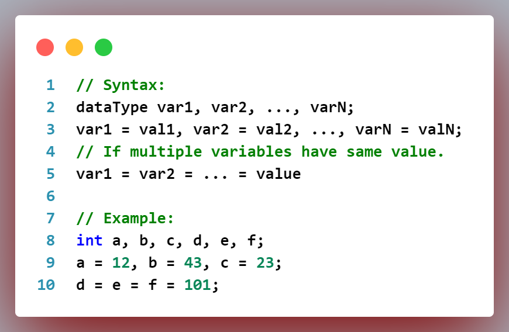

# **`LearningCpp :`**

## **Introduction to _`C++`_ programming:**

- Developed by **_Bjarne Stroustrup_** as an extension to **C language.**

- **_C++_** is a **cross-platform** and **object-oriented** programming language.

- It is used to **create high-performance applications.**

- Provides **high-level of control over system resources** and **memory**.

## **Main differences between _`C++`_ & _`C`_:**

- **_<u>`C++`</u> :_**

  - Supports both **procedural** & **object-oriented programming**.

  - Encapsulate both **Data** & **Functions** together as an object.

  - Supports both **Built-in** & **User-defined** data types.

  - **Object driven** language beacause of **OOPs**.

  - **Namespace** features are present in **_`C++ programming`_** to **avoid name collisions**.

  - **Standard IO** header is **_`#include <iostream.h>`_** or **_`#include <iostream>`_**.

- **_<u>`C`</u> :_**

  - Supports **procedural programming** but not **OOPs.**

  - **Data** & **Functions** are separated because of **procedural programming**.

  - Supports only **Built-in** data types but not **User-defined** data types.

  - **Function driven** language because it is **procedural programming.**

  - **Namespace** features are not present in **_`C-programming`_**.

  - **Standard IO** header is **_`#include <stdio.h>`_** or **_`#include <stdio>`_**.

  > [**_<u>`Learn more`</u>_**](https://www.geeksforgeeks.org/difference-between-c-and-c/) about differences between **_`C++`_** & **_`C`._**

## **Minimal requirements to run a _`C++`_ code:**

- A **_`C++`_ compiler** installed on your system to compile **_`C++`_** code into machine readable format. Most widely used **_`C++`_** compilers are:

  - **GNU Compiler Collection (GCC):** [**_<u>`download here`</u>_**](https://sourceforge.net/projects/mingw-w64/)

  - **Clang**

  - **Microsoft Visual C++ Compiler** (For Microsoft VS code user)

- A **Text-editor** or an **Integrated Development Environment (IDE).**

  - **_Text-editor :_** Notepad++, Sublime text, Atom.

  - **_IDE :_** Turbo C/C++, Visual Studio Code, Code::Blocks, Eclipse, Xcode.

  ### **Follow the steps to run your code:**

  After complete installation of an **IDE** and a **text-editor.**

  - Write your code in the text-editor and save it with **_`.cpp`_** / **_`.cc`_** / **_`.cxx`_** / **_`.c++`_** extension.

  - Once **_`.cpp`_** file is saved, open any terminal or command prompt.

  - Navigate to the folder where **_`.cpp`_** files are saved.

  - Now **Compile** and **Run** with the following command:

    - **_To <u>Build / Compile</u> :_** Write command **_`g++ -o filename filename.cpp`_** in command line **Hit Enter.**

      

              // To compile / build C++ code.
              >> g++ -o filename filename.cpp
                              OR
              >> g++ -std=c++11 demo.cpp -o demo

    - **_To <u>Run</u> :_** Write command **_`filename.exe`_** in command line and **Hit Enter.**

      

              // To run C++ code.
              >> filename.exe // In window cmd prompt.
                              OR
              >> ./filename // In VS Code terminal

## **Basic Structure of _`C++`_ programming:**

- Here is the **basic structure** of **_`C++`_** code.

  

          // Basic structure of C++ code.

          #include <iostream>

          using namespace std;

          int main() {
            // Code goes here
            return 0;
          }

### **_Explanation:_**

- **_Line 1:_** This is a **single line comment,** not executable by compiler.

- **_Line 3:_** consists of a **_<u>Preprocessor Directives</u>_** & **_<u>Header File Liberary</u>._**

  - **_Preprocessor directives: <u>`#include`</u>, <u>`#define`</u>_ etc.**

    - It instructs the compiler and processed before code compilation. It starts with **hash _( `#` )_** character.

    - **_`#include`:_** Used to **include _header file liberary._**

      

              #include <iostream>
              #include <cmath>
              #include <string>

    - **_`#define`:_** Used for **defining _constant_** or **_macros._**

      

              // Defining constant.
              // Syntax:
              #define constName constVal

      

              // Defining Macros.
              // Syntax:
              #define MACRO_NAME(parameters) macro_body

              // Example:
              #define SQUARE(x) ((x)*(x))

  - **_Header file liberary: <u>`<iostream>`</u>, <u>`<cmath>`</u>, <u>`<ctime>`</u>, <u>`<fstream>`</u>, <u>`<string>`</u>_ etc.**

    - Each header file liberary offers a wide range of functionalities to use within the **_`C++`_** code.

    - **_`<iostream>` :_** Provides facilities for performing **input** and **output operations.**

      **_1._** It defines several **classes and objects** that allow you to work with **input streams _( `std::cin` )_** and **output streams _( `std::cout`, `std::cerr`, `std::clog` )._**

      **_2._** Provides **escape characters** like **_( `std::endl`, `std::ends` )_**

    - **_`<cmath>` :_** Provides a collection of **mathematical functions.**

      **_1._ Trigonometric functions: _`sin(x)`_, _`cos(x)`_, _`tan(x)`_, _`asin(x)`_, _`acos(x)`_, _`atan(x)`_, _`sinh(x)`_, _`cosh(x)`_, _`tanh(x)`_ etc.**

      **_2._ Exponential & Logarithmic Functions: _`exp(x)`_, _`log(x)`_, _`log10(x)`_, _`log2(x)`_, _`pow(x, y)`_ etc.**

      **_3._ Square root and Absolute functions: _`sqrt(x)`_, _`fabs(x)`_**

      **_4._ Rounding functions: _`ceil(x)`_, _`floor(x)`_, _`round(x)`_ etc.**

    - **_`<ctime>` :_** Provides functionality for working with **date and time information.**

    - **_`<string>` :_** Defines the **string class** and related **functions for string manipulation**.

          #include <string>

      **_1._ String declaration and initialization:**

          std::string str1 = "Hello World!";

      **_2._ Strings concatenation:**

          std::string str1 = "Hrishikesh ";
          std::string str2 = "Kumar";
          std::string result = str1 + str2;

          // Output:
          Hrishikesh Kumar

      **_3._ Accessing character from string:**

          std::string str1 = "Hrishikesh";
          char i_th_char = str[i];
          char j_th_char = str[j];

      **_4._ String manipulation:**

      - **Finding substrings:**

            // find index position of first matched character.

            std::string str1 = "hrishikesh";
            size_t k_pos = str1.find("k");
            std::cout << k_pos;

      - **Erasing substrings:**

            // erase 3 characters starting from index-3.

            std::string str1 = "hrishikesh";
            std::cout << str1.erase(3,3);

      - **Replacing substrings:**

            // replace 3 characters starting from index-3 by "Kumar".

            std::string str1 = "hrishikesh";
            std::cout << str1.replace(3,3,"Kumar");

      **_5._ String conversion:**

      - **String to Integer: _( `stoi(str)` )_**

            // convert string into integer value.

            std::string str1 = "5";
            int num = std::stoi(str1);
            std::cout << "String to int: " << num ;

      - **String to Float: _( `stof(str)` )_**

            // convert string into float value.

            std::string str1 = "5.755";
            float num = std::stof(str1);
            std::cout << "String to float: " << num ;

      - **Integer/Float to String: _( `to_string(int_num/float_num)` )_**

            // convert integer into string.
            // convert int/float into string.

            float num1 = 56.3;
            int num2 = 435;
            std::string str1 = std::to_string(num1);
            std::string str2 = std::to_string(num2);
            std::cout << "float to string: " << str1 << std::endl;
            std::cout << "int to string: " << str2;

    > **_NOTE :_** Never terminates the header files with semicolon **_( `;` )_**

- **_Line 5:_** **_`using namespace std;`_** It includes **_`namespace`_** standard liberary to prevent naming conflicts.

  - Used to **organize code into logical groups.**

  - Allows to remove prefix **_`std::`_** from every standard liberary functions.

  - When we use **_`using namespace std;`_** directives. Then -

    - **_`std::cout`_** can be written as **_`cout`_.**

    - **_`std::cin`_** can be written as **_`cin`_.**

    - **_`std::endl`_** can be written as **_`endl`_ etc.**

- **_Line 7:_** **_`int main()`_** It is the **_`main()`_** function that we'll see in every C++ code.

  - Actually code execution begins inside **_`main()`_** function.

  - **_`main()`_** function must have a return type of **_`int`_.**

- **_Line 7 col-12: ( `{` ) :_** Begins the **`main()` function body**.

- **_Line 8:_** Spaces for function body to be written here enclosed within curly braces **_( `{`_**
  **// function body**
  **_`}` )._**

- **_Line 9: `return 0;`_** Terminates the code execution inside **_`main()`_** function.

- **_Line 10 col-1 : ( `}` ) :_** Ends the **_`main()`_ function body**.

## **Life cycle of C++ code:**

- Life cycle of **_`C++`_** code involves the following steps:

  - **Creating source code** and save source code with some filename followed by appropriate extension. such as **_`.cpp`, `.c++`, `.cc`_** or **_`.cxx`._**

  - **Compile the code.**

  - On successful compilation of source code, it will **create an object file** with extension **_`.obj`._**

  - Then the **object file** is **linked** with **required liberary** for the proper execution of code.

  - After that an **executable file is created** with the name **_`filename.exe`._**

  - **Now the code is ready for execution.**

  

## **Some standard liberary objects:**

- **_`cout` :_**

  - Used with **_( `<<` )_ to write/print output values/text** on console/display.

  - By default **_`cout`_ does not insert** any **new line** automatically after the completion of **_`cout`_** statement(s).

  - Use **newline-character _( `\n` )_** or **_`endl`_** to **jump to new line.**

    

          #include <iostream>

          using namespace std;
          int main(){
            cout<<"hello world";
            cout<<"This is first cpp programm.";
            return 0;
          }

          /* =============================== */
          /*              Output:            */
          /* =============================== */
          hello worldThis is first cpp programm.

- **_`cin` :_**

  - Used with **_( `>>` )_** to **Reads data** from the keyboard or other input devices.

  - It **automatically adds newline-character _( `\n` )_** after reading the input data(s).

  - **_`cin`_** considers **white-space** as **terminating character.**

    

  - To retain **white-space**, use **_`getline()`_** method.

            // Syntax:
            getline(cin, stringName);

            // instead of `cin >> stringName;`

  - **e.g:-**

    

  > **_[NOTE :]_**
  >
  > > **_1._ _( `>>` ) :_** known as **Stream extraction operator** or simply **Extraction operator.**
  >
  > > **_2._ _( `<<` ) :_** known as **Stream insertion operator** or simply **Insertion operator.**

- **_`endl` :_** Terminate the current line and jump into a **new-line.**

  - **e.g:-**

    

          #include <iostream>

          using namespace std;
          int main(){
            cout<<"hello world"<<endl;
            cout<<"This is first cpp programm.";
            return 0;
          }

          /* =============================== */
          /*              Output:            */
          /* =============================== */
          hello world
          This is first cpp programm.

## **Escape Sequence:**

- **_newline character (`\n`) :_** Terminate the current line and jump into a **new-line.**

- **_tabspace character (`\t`) :_** Insert a **tabspace** (that is equivalent to **_4-space character_**) **between current-line and new-line** or **within a line.**

- **_backslash character (`\\`) :_** Insert a **backslash** character.

- **_double quote character (`\"`) :_** Insert a **double quote** character.

  - **e.g:-**

    

            #include <iostream>

            using namespace std;

            int main(){
              cout<<"1. New-line character.\n";
              cout<<"2. tab-space\tcharacter."<<endl;
              cout<<"3. backslash\\character.\n";
              cout<<"4. \"double quote\"";
              return 0;
            }

            /* ================================= */
            /*             Output:               */
            /* ================================= */
            1. New-line character.
            2. tab-space	character.
            3. backslash\character.
            4. "double quote"

## **Comment style in _`Cpp` :_**

- There are two ways to write comment in _`Cpp`_.

  

        // This is single line comment.

        /*
        This
        is
        multiline
        comment.
        */

## **Variable Declaration:**

- **Variables:** Variables in **_`C++`_** are like containers to **store data values.**

- **_Variables declaration:_** There can be couple of ways to declare a variable in **_`C++`._**

  - Assign value to variable while declaring it.

    

            // Syntax:
            dataType varName = value;

            // Example:
            int num = 24;
            float n = 2.34;
            char character = 'H';
            string str = "Hrishikesh";

  - Declaring varible and assigning it later.

    

            // Syntax:
            dataType varName;
            varName = value;

            // Example:
            float n;
            string str;
            n = 2.01;
            str = "C++";

  - Declaring more than one variable of same type in a single statement.

    

            // Syntax:
            dataType var1 = val1, var2 = val2, ..., varN = valN;

            // Example:
            int a = 12, b = 43, c = 23;
            string fname = "Hrishikesh", lname = "Kumar";

  - Declaring variables and then assigning it later.

    

            // Syntax:
            dataType var1, var2, ..., varN;
            var1 = val1, var2 = val2, ..., varN = valN;
            // If multiple variables have same value.
            var1 = var2 = ... = value

            // Example:
            int a, b, c, d, e, f;
            a = 12, b = 43, c = 23;
            d = e = f = 101;

> **_NOTE :_** If a variable is assigned with new value, its earlier value will be overwritten if any.

## **Constant Declaration:**

- A value is declared as **constant** which is **not likely to be changed** further in the code.

- A **constant declaration** must follow the rules to avoid any occurance of errors in following cases:

  - **must be assigned during its declaration**.

  - **should not be re-assigned** after its declaration.

    

- It is **declared using _`const`_** keyword in **_`C++`._**

  

          // Syntax:
          const dataType varName = value;

          // Example:
          const float PI = 3.1428;
          const int daysPerWeek = 7;

## **Identifiers:**

- **Identifiers** are actually used to name variables. There are some important rules to follow while creating an identifier/variable.

  - It must contains only **letters, digits** and **underscores ( `_` ).**
  - It must **start with** either **letter or underscore** but not digit.
  - Identifiers are **case-sensitive**.
  - **White-space(s)** are **not allowed** in identifier.
  - Special characters **(!, @, #, $, %...etc.)** are **not allowed** except underscore **( \_ ).**
  - Reserved key-word in Cpp are not allowed to be used as an identifier.

## **Data types in _`C++`:_**

### **Primitive data types:**

- Various data types that are supported in **_`C++`_** are:

  - **`bool` ( 1** byte **) _:_** Only two values: **_true = 1_**, **_false = 0._**

  - **`char` ( 1** byte **) _:_** can be assined with **_only one character_** within single quote **_:_** like **_`'e'`_.**

  - **`int` ( 2** or **4** bytes **) _:_** stores only **_non-decimal numbers_** with smaller range.

  - **`float` ( 4** bytes **) _:_** stores only **_decimal numbers_** with smaller range.

  - **`double` ( 8** bytes **) _:_** stores only **_decimal numbers_** with larger range.

  - **`string` ( 32** bytes **) _:_** stores **_sequence of characters_** within double quotes ( **_`" "`_** ) and **_Not built-in type_**, but behaves like one.

### **Decimal number precision**:

- **_`float` :_ 6** or **7** digits.
- **_`double` :_ 15** digits.

### **Qualifiers:**

- **Qualifiers** in **_`C++`_** are used to **manipulate** the **_size (or range)_** and/or **_sign_** or **_behaviour_** of the **primitive data types.** such as **int, float, double.**

  - Qualifiers that are used to manipulate the sizes of data types:

    - **`short` ( 2** bytes **) _:_** stores only **non-decimal numbers** with smaller range than **_`int`_** generally.

    - **`long` ( 4** bytes **) _:_** stores only **non-decimal numbers** with larger range than **_`int`_**.

    - **`long long` ( 8** bytes **) _:_** stores only **non-decimal numbers** with larger range than **_`long`_**.

    - **`double long` ( 16** bytes **) _:_** stores only **decimal numbers** with larger range.

  - Qualifiers that are used to manipulate the sign of data types:

    - **`signed` ( 4** bytes **) _:_** Stores both **positive** and **negative** values.

    - **`unsigned` ( 4** bytes **) _:_** Stores only **positive** values.

  - Qualifiers that are used to manipulate the behaviour of data types:

    - **`const` _:_** It restricts the re-assigning new values to the data type prefixed with **_`const`_** keyword.

## **Operators in _`C++`_ :**

- Operators are used to perform specific operations on operands (variable(s) or value(s)).

- There are typically two types of operators:
  - Binary operator
  - Unary operator

### **Arithmatic operators:**

- Arithmatic operators are binary operators that are used to perform mathematical operations on operands. Various arithmatic operators are:

  - **Addition _( `+` )_ :** used to adds two or more numbers.
  - **Subtraction _( `-` )_ :** used to find difference between two numbers.
  - **Multiplication _( `*` )_ :** used to find product of two or more numbers.
  - **Division _( `/` )_ :** used to divide a number by another number.
  - **Modulus _( `%` )_ :** used to find remainder when a number is divided by another number.

### **Assignment operators:**

- desc

#### **Simple assignment :**

- **Assignment _( `=` )_ :** used to assign the value of right operand to the left operand.

#### **Compound assignment :**

- **Addition assignment _( `+=` )_ :** used to update value of left operand by adding value of right operand to the initial value of left operand.
- **Subtraction assignment _( `-=` )_ :** used to update value of left operand by subtracting value of right operand from the initial value of left operand.
- **Multiplication assignment _( `*=` )_ :** used to update value of left operand by multiplying value of right operand with initial value of left operand.

- **Division assignment _( `/=` )_ :** used to update value of left operand by adding value of right operand to th initial value of left operand
- **Modulus assignment _( `%=` )_ :** used to assign the value of right operand to the left operand.

### **Unmary operators:**

### **Relational operators:**

### **Logical operators:**

### **Bitwise operators:**

### **Ternary or Conditional operators:**
